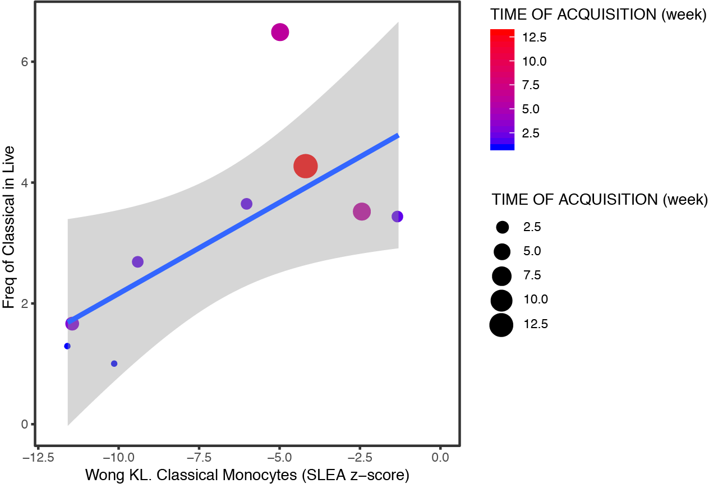

# P168: source code
  
## List of figures:  
[Fig. 2c](#fig-2c)  

### Fig. 2c
  
Fig. 2c: [R code [MD]](code/)  

## Supplemental material:  
  
code:  
- preprocessing: [R code [MD]](code/20180102_P168.preprocessing.md)  
  
input:  
- non-normalized (raw) intensities: [[CSV]](input/p168.GA_Agilent_one_color_matrix.Matrix_non-normalized.csv)  
- background intensities: [[CSV]](input/p168.GA_Agilent_one_color_matrix.Matrix_background.csv)  
- arrays annotation: [[CSV]](input/p168.GA_Agilent_one_color_matrix.Metadata.csv)  
- probes annotation: [[CSV]](input/p168.featAnnatation.csv)  
