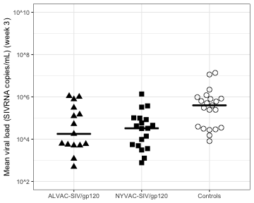

# P168: source code
  
## List of figures:  
[Fig. 1e](#fig-1e)  

### Fig. 1e
  
Fig. 1e: [R code [MD]](code/20190814_P168.fig1e.md), [Input file [CSV]](input/p168.vl.csv)  

## Supplemental material:  
  
code:  
- preprocessing: [R code [MD]](code/20180102_P168.preprocessing.Rmd)  
  
input:  
- non-normalized (raw) intensities: [[CSV]] (input/p168.GA_Agilent_one_color_matrix.Matrix_non-normalized.csv)  
- background intensities: [[CSV]] (input/p168.GA_Agilent_one_color_matrix.Matrix_background.csv)  
- arrays annotation: [[CSV]] (input/p168.GA_Agilent_one_color_matrix.Metadata.csv)  
- probes annotation: [[CSV]] (input/p168.featAnnatation.csv)  
