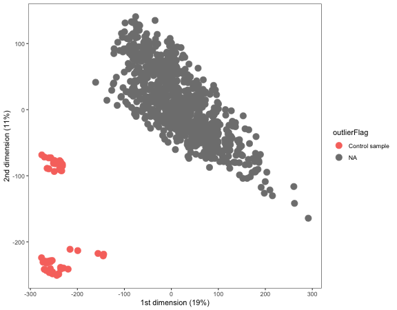
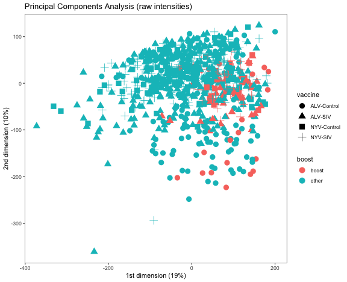
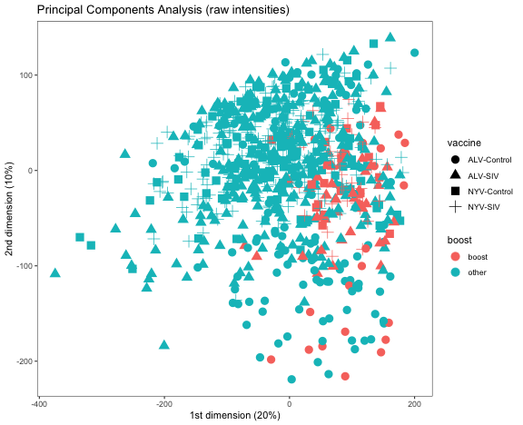

loading require packages

```r
suppressPackageStartupMessages(library(package = "knitr"))
suppressPackageStartupMessages(library(package = "limma"))
suppressPackageStartupMessages(library(package = "pheatmap"))
suppressPackageStartupMessages(library(package = "tidyverse"))
```

set default options/variables

```r
workDir <- dirname(getwd())
opts_chunk$set(tidy = FALSE, fig.path = "../figure/")
options(stringsAsFactors  = FALSE,
        width             = 80,
        readr.num_columns = 0)
```

read non-normalized matrix

```r
rawFile <- "p168.GA_Agilent_one_color_matrix.Matrix_non-normalized.csv"
rawFile <- file.path(workDir, "input", rawFile)
rawMat <- read_csv(file = rawFile, progress = FALSE)
bgFile <- file.path(workDir,
		    "input",
		    "p168.GA_Agilent_one_color_matrix.Matrix_background.csv")
bgMat <- read_csv(file = bgFile, progress = FALSE)
```

read arrays annotation

```r
arraysAnnotFile <- file.path(workDir,
                             "input",
                             "p168.GA_Agilent_one_color_matrix.Metadata.csv")
arraysAnnotation <- read_csv(file = arraysAnnotFile, progress = FALSE)
# remove unused phenotypic information
arraysAnnotation <- select(arraysAnnotation,
                           -title,
                           -`source name`,
                           -organism,
                           -molecule,
                           -label,
                           -description,
			   -`raw data file`,
                           -`platform or Agilent design ID`)
# remove prefix 'characteristics` of column names
names(arraysAnnotation) <- gsub(pattern = "^[^:]+: (.+)$",
                                replacement = "\\1",
                                names(arraysAnnotation))
```

read features annotation

```r
featuresAnnotFile <- file.path(workDir, 
                               "input/p168.featAnnatation.csv")
featuresAnnotation <- read_csv(file = featuresAnnotFile, progress = FALSE) %>%
    as.data.frame()
```

create non-normalized EList

```r
# format raw matrix
RGraw <- new("EListRaw", list(E = rawMat,
			      Eb = bgMat,
			      targets = arraysAnnotation,
			      genes = featuresAnnotation))
```

background correction

```r
RGbc <- backgroundCorrect(RGraw, method = "normexp", offset = 1, verbose = FALSE)
# save raw file
save(RGbc, file = file.path(workDir, "output/p168.elistRaw.RData"))
```

normalize arrays

```r
RGnorm <- normalizeBetweenArrays(RGbc, method = "quantile")
# average duplicated probes
RGave <- avereps(RGnorm, ID = RGnorm$genes$ProbeName)
rownames(RGave$genes) <- RGave$genes$ProbeName
```

principal component analysis

```r
fit <- prcomp(t(RGave$E), scale. = TRUE)
plotDF <- fit$x[, 1:2] %>%
  as.data.frame() %>%
  rownames_to_column() %>%
  cbind(RGave$targets) %>%
  mutate(outlierFlag = ifelse(test = donor %in% "Control",
                              yes  = "Control sample",
                              no   = NA))
ggplot(data    = plotDF,
       mapping = aes(x = PC1,
                     y = PC2,
                     color = outlierFlag)) +
    geom_point(size = 4) +
    labs(x     = paste0("1st dimension (",
                 round((fit$sdev^2/sum(fit$sdev^2))[1] * 100),
                 "%)"),
         y     = paste0("2nd dimension (",
                 round((fit$sdev^2/sum(fit$sdev^2))[2] * 100),
                 "%)")) +
  theme_bw() +
  theme(panel.grid = element_blank())
```



```r
wilcox.test(formula = PC1 ~ is.na(outlierFlag), data = plotDF)$p.value
```

```
## [1] 3.594822e-36
```

```r
wilcox.test(formula = PC2 ~ is.na(outlierFlag), data = plotDF)$p.value
```

```
## [1] 1.953079e-34
```

principal component analysis (no controls)

```r
RGtemp <- RGave[, RGave$targets$donor != "Control"]
fit <- prcomp(t(RGtemp$E), scale. = TRUE)
plotDF <- fit$x[, 1:2] %>%
  as.data.frame() %>%
  rownames_to_column() %>%
  cbind(RGtemp$targets) %>%
  mutate(boost = ifelse(test = grepl(pattern = "w12|wk24",
				     timepoint),
                        yes  = "boost",
                        no   = "other"),
         boost = ifelse(test = timepoint %in% "w12.0h",
                        yes  = "other",
                        no   = boost))
ggplot(data    = plotDF,
       mapping = aes(x = PC1,
                     y = PC2,
                     color = boost,
                     shape = vaccine)) +
    geom_point(size = 4) +
    labs(x     = paste0("1st dimension (",
                 round((fit$sdev^2/sum(fit$sdev^2))[1] * 100),
                 "%)"),
         y     = paste0("2nd dimension (",
                 round((fit$sdev^2/sum(fit$sdev^2))[2] * 100),
                 "%)"),
         title = "Principal Components Analysis (raw intensities)") +
  theme_bw() +
  theme(panel.grid = element_blank())
```



```r
filter(plotDF, PC2 < -250)
```

```
##             rowname        PC1       PC2       Sample name  donor vaccine
## 1 P168_A06028_w0.6h -234.24573 -361.0576 P168_A06028_w0.6h A06028 ALV-SIV
## 2   P168_R808_w4.0h  -91.25754 -293.9050   P168_R808_w4.0h   R808 NYV-SIV
##   time of acquisition timepoint time of acquisition unit boost
## 1        not infected     w0.6h                     week other
## 2                   4     w4.0h                     week other
```

principal component analysis (no outliers)

```r
RGtemp <- RGave[, RGave$targets$donor != "Control" &
		    !(RGave$targets$"Sample name" %in%
			c("P168_A06028_w0.6h",
			  "P168_R808_w4.0h"))]
fit <- prcomp(t(RGtemp$E), scale. = TRUE)
plotDF <- fit$x[, 1:2] %>%
  as.data.frame() %>%
  rownames_to_column() %>%
  cbind(RGtemp$targets) %>%
  mutate(boost = ifelse(test = grepl(pattern = "w12|wk24",
				     timepoint),
                        yes  = "boost",
                        no   = "other"),
         boost = ifelse(test = timepoint %in% "w12.0h",
                        yes  = "other",
                        no   = boost))
ggplot(data    = plotDF,
       mapping = aes(x = PC1,
                     y = PC2,
                     color = boost,
                     shape = vaccine)) +
    geom_point(size = 4) +
    labs(x     = paste0("1st dimension (",
                 round((fit$sdev^2/sum(fit$sdev^2))[1] * 100),
                 "%)"),
         y     = paste0("2nd dimension (",
                 round((fit$sdev^2/sum(fit$sdev^2))[2] * 100),
                 "%)"),
         title = "Principal Components Analysis (raw intensities)") +
  theme_bw() +
  theme(panel.grid = element_blank())
```




remove controls and outliers from EList

```r
RG <- RGave[, RGave$targets$donor != "Control" &
		!(RGave$targets$"Sample name" %in%
		    c("P168_A06028_w0.6h", "P168_R808_w4.0h"))]
```

average technical replicates

```r
sampleIds <- gsub(pattern     = "_rep[0-9]",
		  replacement = "",
		  RG$targets$"Sample name")
dupLS <- unique(sampleIds[duplicated(sampleIds)])
# average duplicates                                                            
RGdup <- RG[, sampleIds %in% dupLS]
mat <- by(t(RGdup$E),
          INDICES = factor(sampleIds[sampleIds %in% dupLS]),
          FUN = colMeans) %>%
  do.call(what = cbind)
# create EList without duplicates                                               
RG <- RG[, !duplicated(sampleIds)]
RG$E[, match(colnames(mat), table = gsub(pattern     = "_rep[0-9]",
					 replacement = "",
					 RG$targets$"Sample name"))] <- mat
# save EList                                                                    
save(RG, file = file.path(workDir, "output/p168.elist.RData"))
```

substract pre-vaccination expression

```r
RGpre <- RG[, RG$targets$timepoint %in% "w0.0h"]
RGbaselined <- RG
RGbaselined$E <- RGbaselined$E -
  RGpre$E[, match(RGbaselined$targets$donor,
		  table = RGpre$targets$donor)]
RGbaselined <- RGbaselined[, setdiff(colnames(RGbaselined), colnames(RGpre))]
# save baselined EList
save(RGbaselined, file = file.path(workDir, "output/p168.elistBaselined.RData"))
```

differential expression

```r
fits <- list()
# save fits
save(fits, file = file.path(workDir, "output/p168.fits.RData"))
```

print session info

```r
sessionInfo()
```

```
## R version 3.6.1 (2019-07-05)
## Platform: x86_64-apple-darwin18.6.0 (64-bit)
## Running under: macOS Mojave 10.14.6
## 
## Matrix products: default
## BLAS/LAPACK: /usr/local/Cellar/openblas/0.3.7/lib/libopenblasp-r0.3.7.dylib
## 
## locale:
## [1] en_US.UTF-8/en_US.UTF-8/en_US.UTF-8/C/en_US.UTF-8/en_US.UTF-8
## 
## attached base packages:
## [1] stats     graphics  grDevices utils     datasets  methods   base     
## 
## other attached packages:
##  [1] forcats_0.4.0   stringr_1.4.0   dplyr_0.8.3     purrr_0.3.2    
##  [5] readr_1.3.1     tidyr_0.8.3     tibble_2.1.3    ggplot2_3.2.1  
##  [9] tidyverse_1.2.1 pheatmap_1.0.12 limma_3.41.16   knitr_1.24     
## 
## loaded via a namespace (and not attached):
##  [1] Rcpp_1.0.2         highr_0.8          cellranger_1.1.0   pillar_1.4.2      
##  [5] compiler_3.6.1     RColorBrewer_1.1-2 tools_3.6.1        digest_0.6.21     
##  [9] zeallot_0.1.0      lubridate_1.7.4    jsonlite_1.6       evaluate_0.14     
## [13] gtable_0.3.0       nlme_3.1-141       lattice_0.20-38    pkgconfig_2.0.3   
## [17] rlang_0.4.0        cli_1.1.0          rstudioapi_0.10    haven_2.1.1       
## [21] xfun_0.9           withr_2.1.2        xml2_1.2.2         httr_1.4.1        
## [25] vctrs_0.2.0        generics_0.0.2     hms_0.5.1          grid_3.6.1        
## [29] tidyselect_0.2.5   glue_1.3.1         R6_2.4.0           readxl_1.3.1      
## [33] modelr_0.1.5       magrittr_1.5       scales_1.0.0       backports_1.1.4   
## [37] rvest_0.3.4        assertthat_0.2.1   colorspace_1.4-1   labeling_0.3      
## [41] stringi_1.4.3      lazyeval_0.2.2     munsell_0.5.0      broom_0.5.2       
## [45] crayon_1.3.4
```
